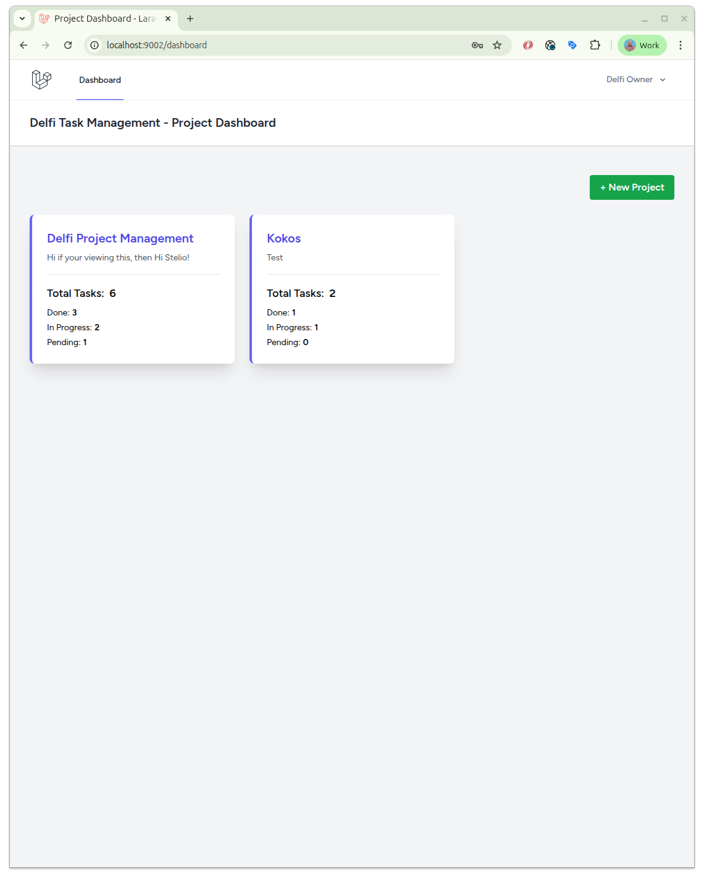
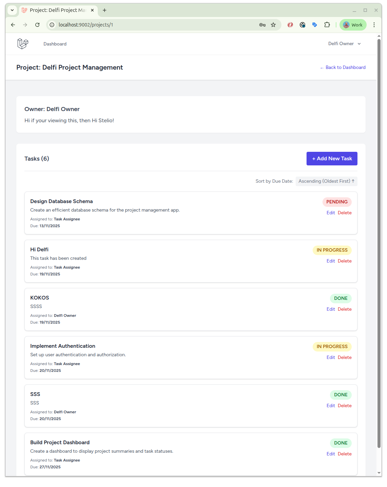
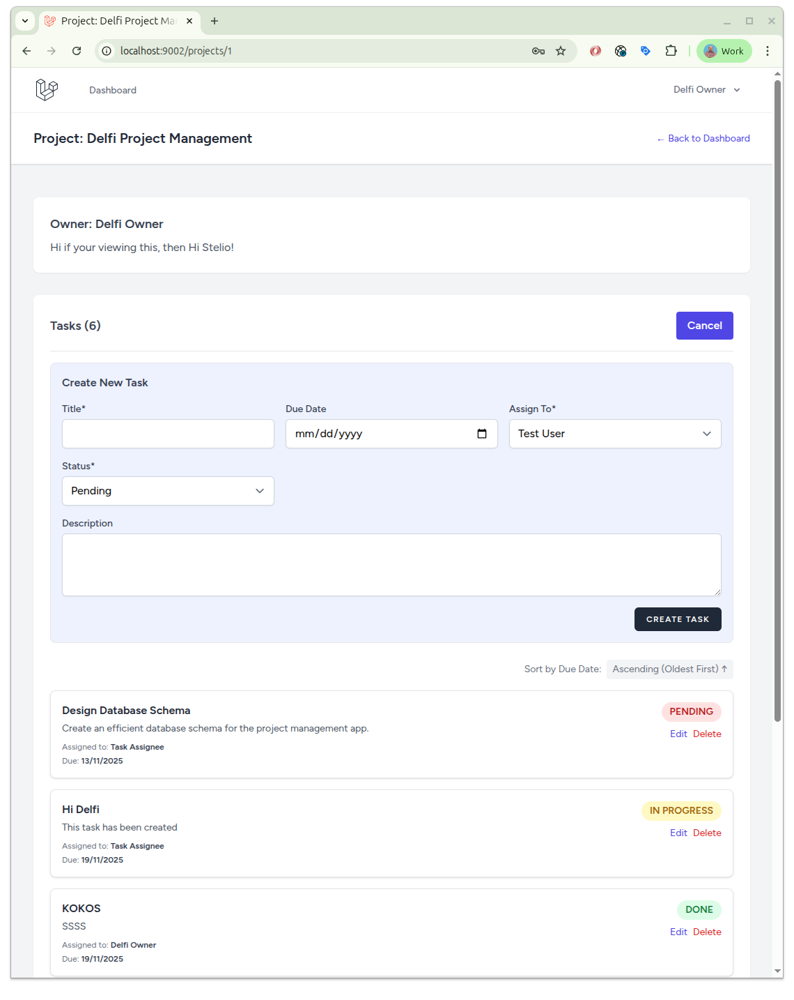
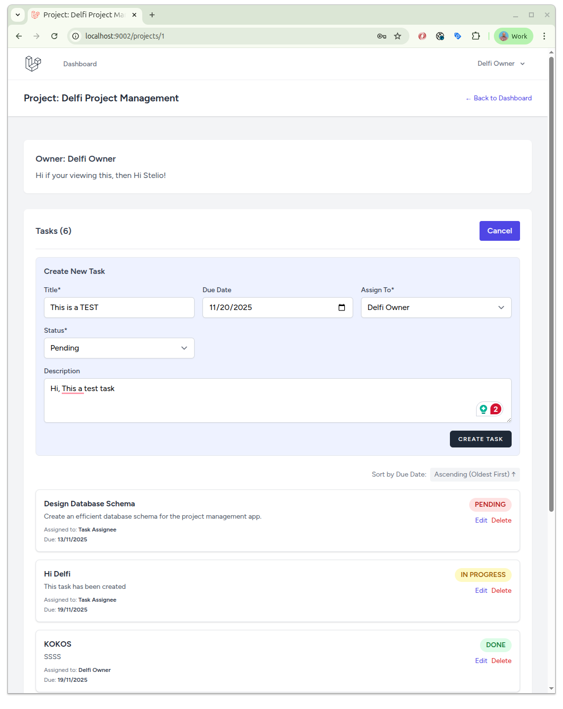
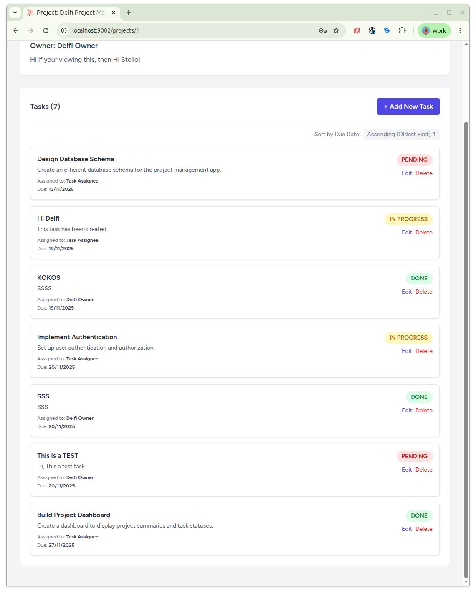
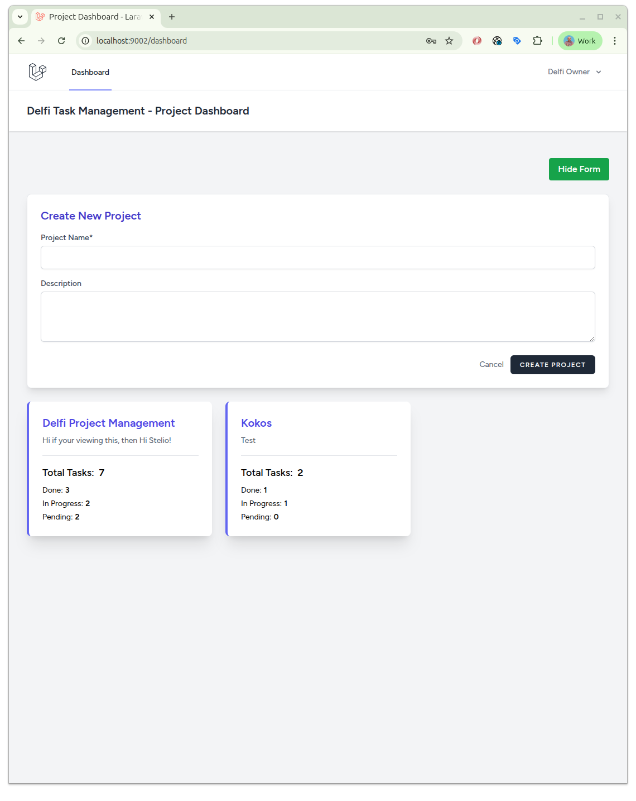
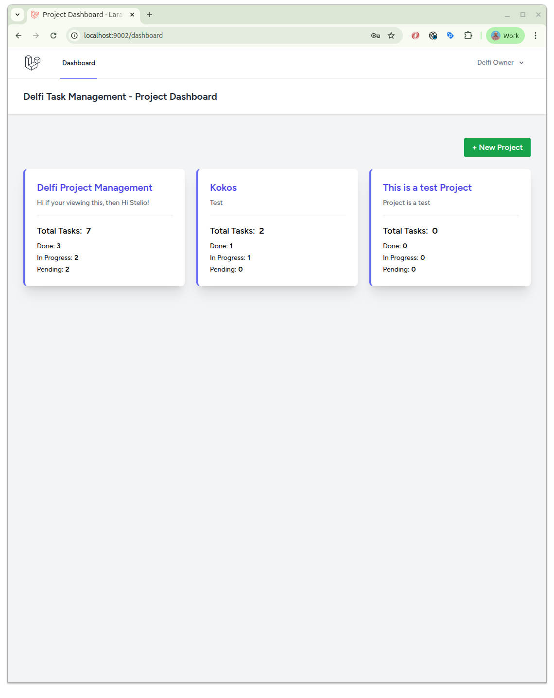

# Task Management Defi

Foobar is a Python library for dealing with word pluralization.

## Installation
```bash
git clone https://github.com/lythro10/task-management.git
cd task-management
```


```bash
docker compose up -d --build
```
## Install packages
```bash
docker compose exec -u root app composer install
```

## Fix Permissions on Storage/Cache
```bash
docker compose exec -u root app chmod -R 777 storage bootstrap/cache
```

## Generage DB Keys
```bash
docker compose exec app php artisan key:generate
```


## Generate Sample Data
```bash
docker compose exec app php artisan migrate:fresh --seed
```

## Login with sample data

Username: owner@example.com
Password: password


## Projects Dashboard


## Tasks of Project


## Add Task


## Details of Task


## Task added in array


## Create new Project


## New Project added in List
